# Windows Infrastructure Administration

Enterprise-style Windows infrastructure project demonstrating Windows Server administration, Active Directory, DNS, Group Policy, file services, endpoint security, PowerShell automation, troubleshooting, recovery, and final system validation.

## Executive Summary

This project simulates the design, deployment, administration, security, troubleshooting, and validation of a small Windows domain environment using Windows Server 2025, Windows 11, Oracle VirtualBox, and PowerShell.

The environment was built around a three-system architecture:

- **DC01** — Active Directory Domain Services, DNS, authentication, and Group Policy
- **SRV01** — Domain-joined member server providing departmental file services
- **CLIENT01** — Windows 11 domain workstation used for authentication, Group Policy enforcement, endpoint security validation, and troubleshooting

The project was intentionally designed as more than a basic Active Directory lab. It incorporates enterprise-style administrative workflows including organizational design, role-based access control, centralized policy management, identity provisioning, auditing, PowerShell automation, intentional failure scenarios, recovery testing, and final infrastructure validation.

> **Evidence:** The README highlights selected screenshots that best demonstrate each capability. The complete chronological evidence trail is available in the [`screenshots/`](screenshots/) directory.

---

## Business Scenario

EllisTech is a fictional organization requiring centralized Windows infrastructure capable of supporting identity management, secure departmental file access, policy enforcement, administrative separation, and repeatable IT operations.

The environment needed to support:

- centralized user authentication
- structured organizational units
- department-based security groups
- least-privilege access
- departmental file shares
- standardized workstation security policies
- authentication auditing
- repeatable onboarding workflows
- infrastructure troubleshooting
- documented recovery procedures
- final operational validation

The goal was to build the environment using administrative practices that could scale into a larger Windows infrastructure environment.

---

## Project Objectives

The project objectives were to:

- deploy a Windows Server domain environment
- configure Active Directory Domain Services and DNS
- create an enterprise-style OU structure
- manage users, security groups, and privileged accounts
- join Windows Server and Windows 11 systems to the domain
- implement secure departmental file services
- configure NTFS and share permissions
- deploy Group Policy security controls
- validate endpoint firewall and antivirus configuration
- enable security auditing
- test account lockout and administrative recovery
- automate administrative tasks with PowerShell
- simulate an HR-to-IT onboarding workflow
- intentionally introduce infrastructure failures
- diagnose and restore DNS, permissions, and Group Policy
- validate final infrastructure health before publication

---

## Lab Architecture

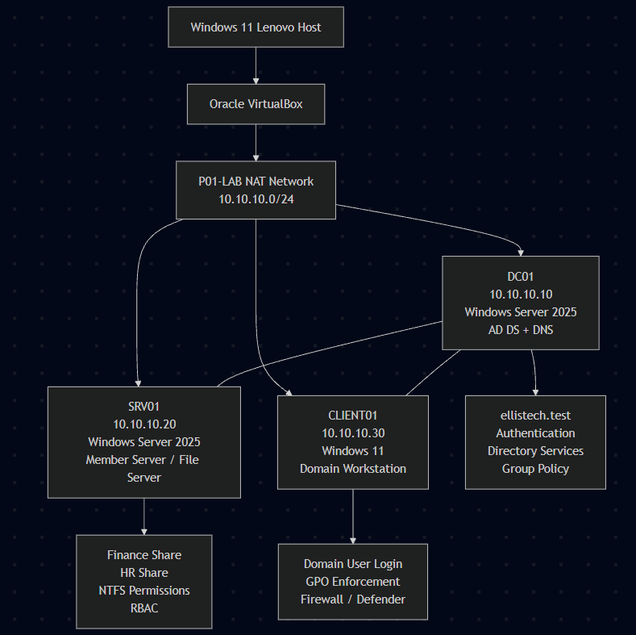

### Environment

| System | Operating System | IP Address | Role |
|---|---|---:|---|
| DC01 | Windows Server 2025 | 10.10.10.10 | Domain Controller, AD DS, DNS, Group Policy |
| SRV01 | Windows Server 2025 | 10.10.10.20 | Member Server, File Services |
| CLIENT01 | Windows 11 | 10.10.10.30 | Domain Workstation |
| Host | Windows 11 | Host-managed | Oracle VirtualBox |

### Network

```text
Network: 10.10.10.0/24
Gateway: 10.10.10.1
Domain: ellistech.test
DNS Server: 10.10.10.10
```

The lab uses a VirtualBox NAT network with static addressing and DNS provided by the Domain Controller.

### Infrastructure Evidence

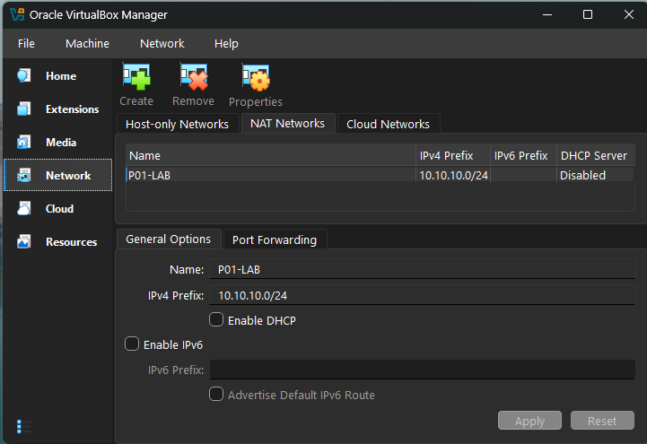

*VirtualBox network created for the Windows infrastructure environment.*

---

## Technologies Used

- Windows Server 2025
- Windows 11
- Active Directory Domain Services
- DNS
- Group Policy Management
- NTFS
- SMB File Sharing
- Microsoft Defender
- Windows Defender Firewall
- Windows Event Viewer
- PowerShell
- Oracle VirtualBox
- Git
- GitHub
- Visual Studio Code

---

# Implementation

## 1. Windows Server Deployment

Windows Server 2025 was deployed as the foundation of the environment.

The first server was configured as:

```text
Hostname: DC01
IP Address: 10.10.10.10
Gateway: 10.10.10.1
Domain: ellistech.test
```

After base networking and hostname configuration, the server was prepared for Active Directory Domain Services.

A second Windows Server system was later deployed as:

```text
Hostname: SRV01
IP Address: 10.10.10.20
DNS: 10.10.10.10
```

SRV01 was joined to the domain and used as a dedicated member/file server rather than placing file services directly on the Domain Controller.

---

## 2. Active Directory Domain Services and DNS

Active Directory Domain Services and DNS were installed on DC01.

A new forest was created:

```text
ellistech.test
```

DC01 was promoted to Domain Controller and configured as the authoritative DNS server for the lab.

DNS resolution was validated from both server and client systems.

Example validation commands included:

```powershell
nslookup ellistech.test
nslookup dc01.ellistech.test
```

The final environment uses:

```text
DNS Server: 10.10.10.10
```

for domain members.

### Evidence

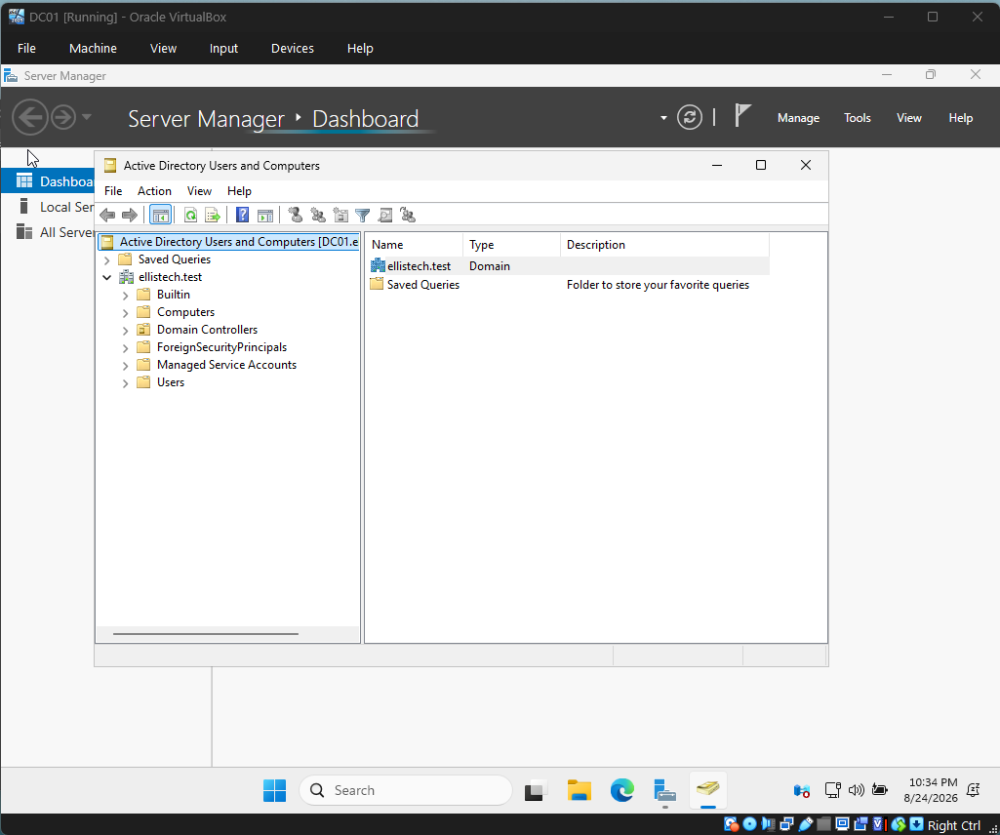

*Successful creation of the `ellistech.test` Active Directory domain.*

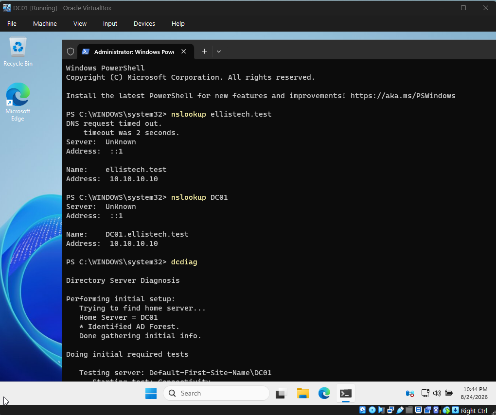

*DNS resolution validated after AD DS and DNS deployment.*

---

## 3. Organizational Unit Design

Instead of placing managed objects directly into default Active Directory containers, a dedicated organizational structure was created.

```text
ellistech.test
└── EllisTech
    ├── Admin Accounts
    ├── Computers
    │   └── Workstations
    ├── Groups
    ├── Servers
    ├── Service Accounts
    └── Users
        ├── Executive
        ├── Finance
        ├── HR
        ├── IT
        ├── Operations
        └── Sales
```

This separates managed company objects from built-in Active Directory containers and provides clearer administrative boundaries for users, computers, servers, groups, and privileged identities.

### Evidence

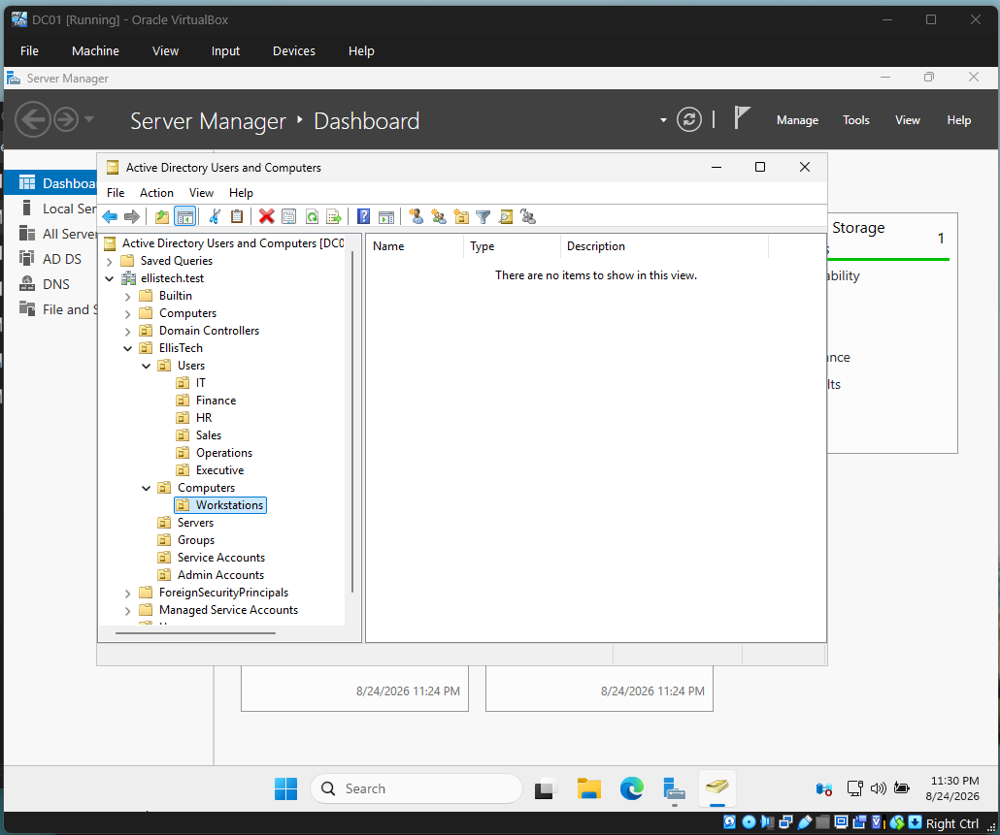

*Final EllisTech organizational structure separating users, groups, servers, workstations, service accounts, and privileged administrative accounts.*

---

## 4. Identity and Security Group Administration

Fictional user accounts were created across multiple departments.

### IT

- Henry Wilson — `hwilson`
- Nicole Ellis — `nellis`

### Finance

- Ben Carter — `bcarter`
- Carla Ruiz — `cruiz`

### HR

- David Lee — `dlee`
- Maria Torres — `mtorres`

A separate privileged administrative account was also created:

```text
adm-nicole
```

This separated normal user activity from administrative activity.

Department and access groups included:

```text
GG_IT
GG_Finance
GG_HR
GG_IT_Admins
GG_Finance_RW
GG_HR_RW
```

Permissions were assigned through groups rather than directly to users wherever possible.

This supports a scalable role-based access control model.

### Evidence

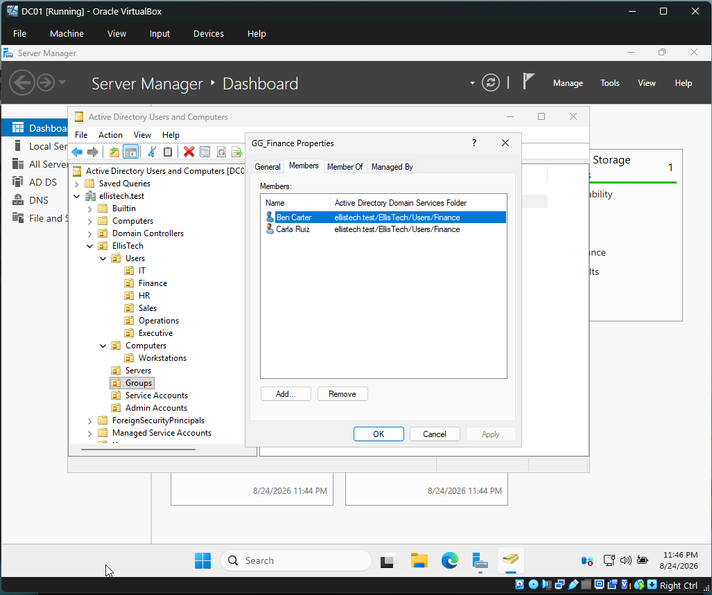

*Security groups used to manage department and administrative access instead of assigning permissions directly to individual users.*

---

## 5. Domain-Joined Systems

SRV01 and CLIENT01 were joined to:

```text
ellistech.test
```

The systems were moved into their appropriate organizational units:

```text
EllisTech
├── Servers
│   └── SRV01
└── Computers
    └── Workstations
        └── CLIENT01
```

Domain authentication was validated on CLIENT01 using standard domain accounts.

Example:

```powershell
whoami
hostname
```

Expected results:

```text
ellistech\bcarter
CLIENT01
```

### Evidence

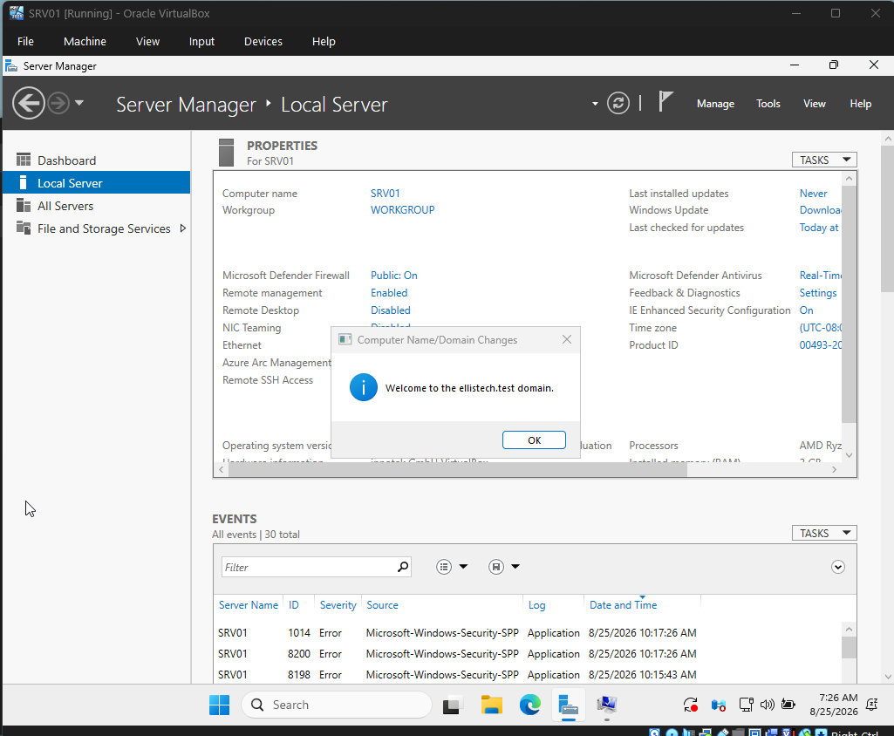

*SRV01 successfully joined to the EllisTech domain.*

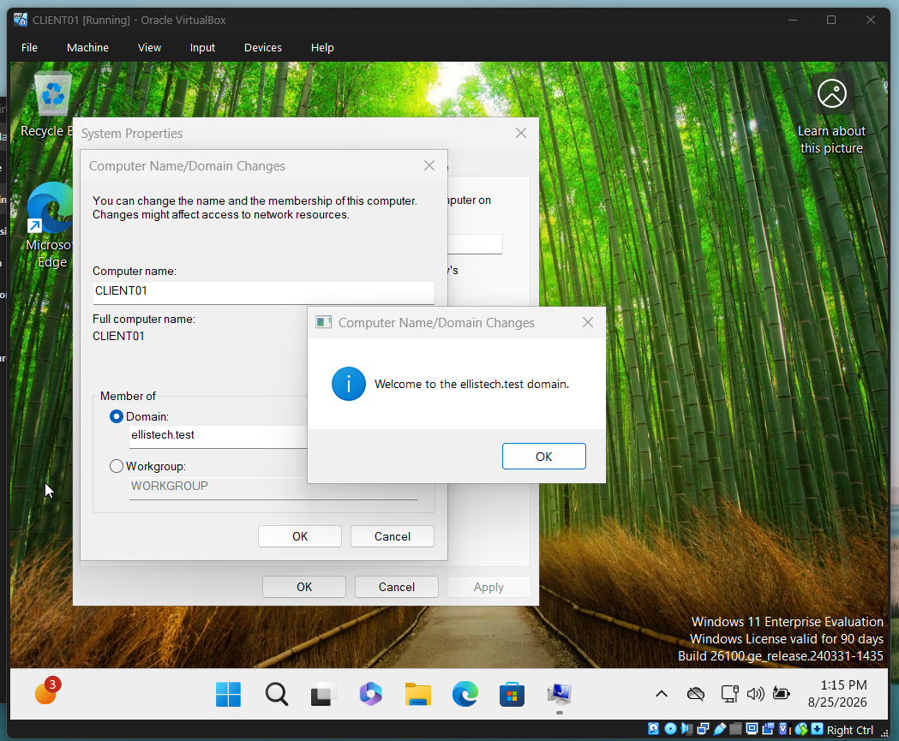

*Windows 11 CLIENT01 successfully joined to `ellistech.test`.*

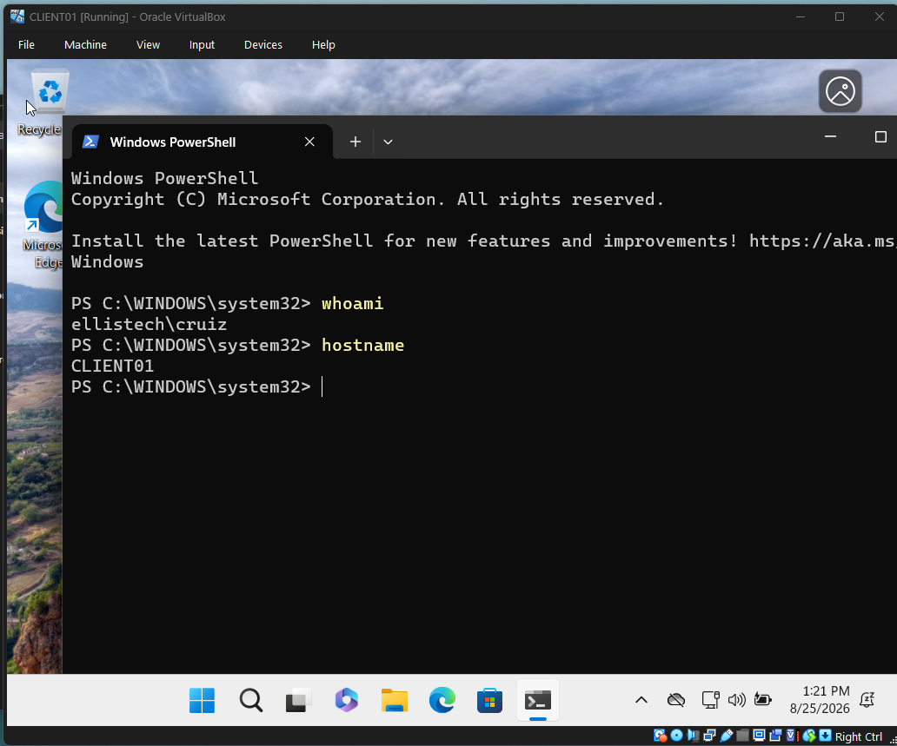

*Successful authentication to CLIENT01 using a standard EllisTech domain identity.*

---

## 6. File Services and Role-Based Access Control

SRV01 was configured as a departmental file server.

Departmental folders were created:

```text
C:\Shares\Finance
C:\Shares\HR
```

### Finance

Share permissions:

```text
GG_Finance_RW → Change / Read
GG_IT_Admins → Full Control
```

NTFS permissions:

```text
GG_Finance_RW → Modify
GG_IT_Admins → Full Control
```

### HR

Share permissions:

```text
GG_HR_RW → Change / Read
GG_IT_Admins → Full Control
```

NTFS permissions:

```text
GG_HR_RW → Modify
GG_IT_Admins → Full Control
```

Inherited permissions that unintentionally provided broader access were removed.

This required disabling inheritance, converting inherited permissions into explicit permissions, and removing the broad Users entry while preserving required system and administrator permissions.

This demonstrated the difference between share-level permissions and NTFS permissions and reinforced that effective access depends on the combination of both security layers.

### Evidence

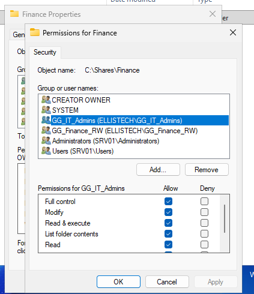

*Finance departmental NTFS permissions configured using security groups.*

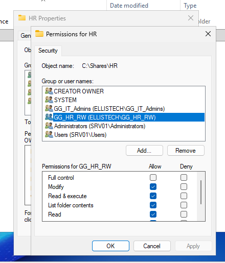

*HR departmental NTFS permissions configured using security groups.*

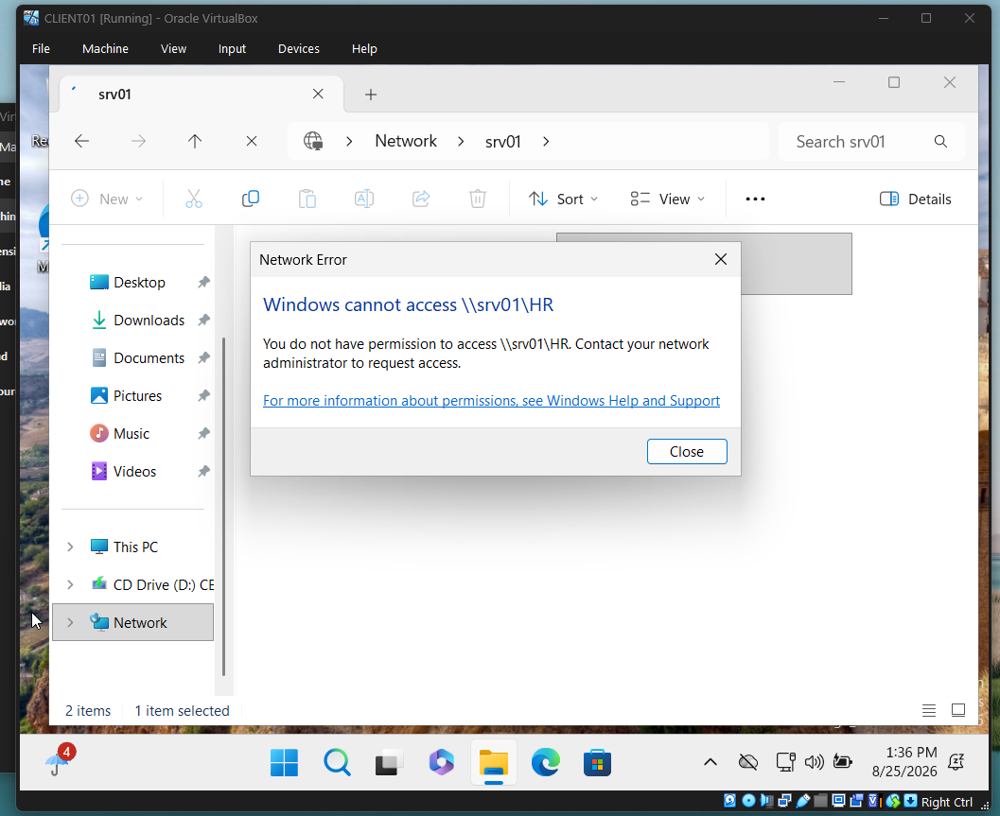

*Finance user denied access to the HR share, validating department-based access controls.*

---

# Group Policy Administration

Multiple Group Policy Objects were created to enforce centralized security and configuration standards.

## Password and Account Policy

A domain-level policy was configured with:

```text
Password history: 5
Maximum password age: 90 days
Minimum password age: 1 day
Minimum password length: 12 characters
Password complexity: Enabled
Account lockout threshold: 5 attempts
Account lockout duration: 15 minutes
Reset lockout counter: 15 minutes
```

---

## Screen Lock Policy

A workstation screen-lock policy was configured to enforce inactivity controls.

Settings included:

```text
Machine inactivity limit: 900 seconds
Screen saver: Enabled
Password protection: Enabled
Screen saver timeout: 900 seconds
```

Because the policy contained both computer-side and user-side settings, it was linked appropriately to ensure both settings applied to the intended objects.

---

## Windows Firewall Policy

Windows Firewall was centrally enforced through Group Policy.

Domain, Private, and Public profiles were configured to remain enabled.

Validation:

```powershell
Get-NetFirewallProfile
```

---

## Microsoft Defender Policy

Microsoft Defender Antivirus and real-time protection were enforced using Group Policy.

Validation:

```powershell
Get-MpComputerStatus
```

Important fields included:

```text
AntivirusEnabled
AntispywareEnabled
RealTimeProtectionEnabled
```

---

## Login Banner

A legal/administrative login banner was configured through Group Policy.

Title:

```text
Authorized Use Only
```

Message:

```text
This system is for authorized users only. Activity may be monitored and logged.
```

The banner was validated through an interactive sign-in test.

### Group Policy Evidence

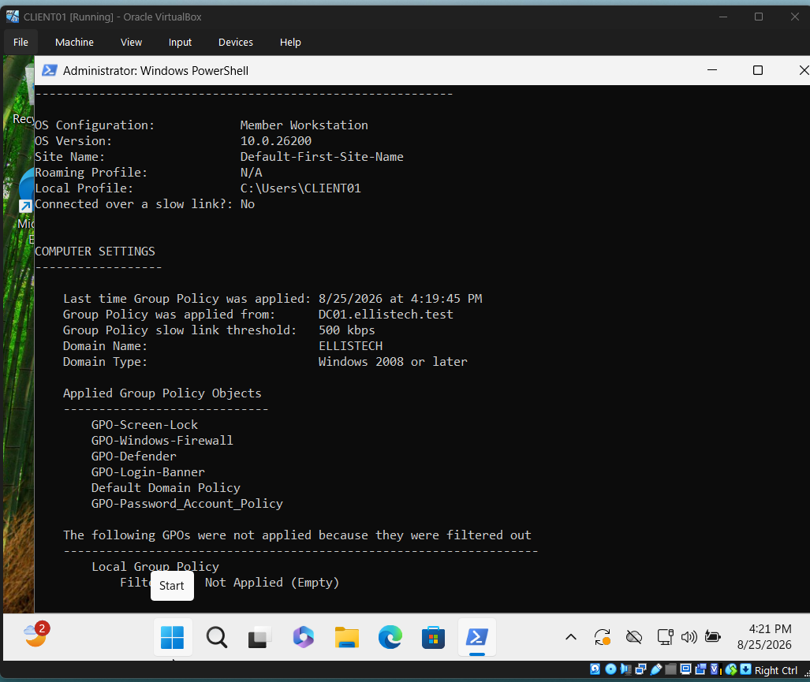

*Effective Group Policy validation on CLIENT01 showing centrally managed workstation policies.*

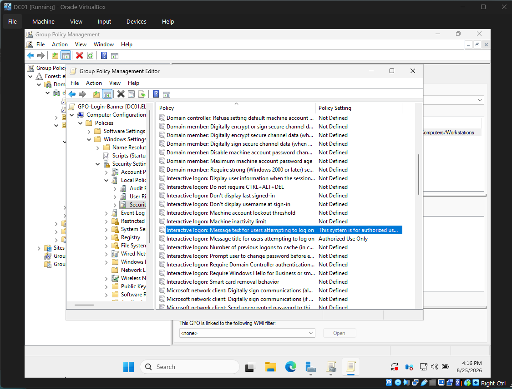

*Centralized login banner configuration through Group Policy.*

---

# Security Hardening and Administrative Controls

## Least Privilege

Standard domain users were verified to ensure they were not local administrators.

Validation:

```powershell
net localgroup administrators
```

Standard accounts such as:

```text
bcarter
cruiz
nellis
```

were not directly granted local administrator privileges.

### Evidence

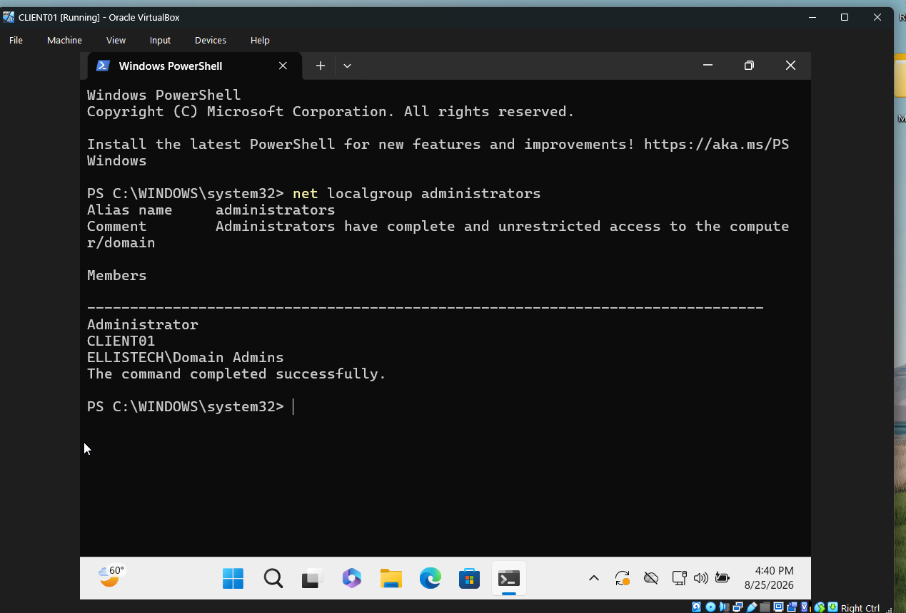

*Validation that standard domain identities are not directly assigned local administrator rights.*

---

## Security Auditing

A dedicated audit policy GPO was configured for Domain Controllers.

Audited categories included:

- successful and failed logons
- credential validation
- user account management
- security group management

Security Event Logs were reviewed to validate authentication activity.

Examples included:

```text
4624 — Successful logon
4625 — Failed logon
```

This demonstrated how Windows Event Viewer can be used to validate identity activity and investigate authentication failures.

### Evidence

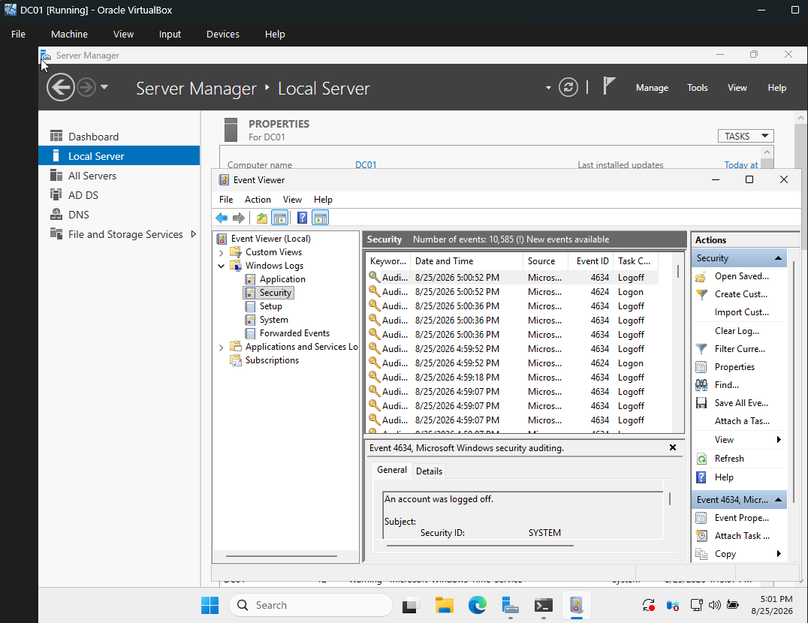

*Windows Security log showing successful Event ID 4624 and failed Event ID 4625 authentication activity.*

---

## Account Lockout and Recovery

The account lockout policy was tested using repeated invalid login attempts.

After the configured threshold was reached:

- the account became locked
- the lockout message was observed
- the account was located in Active Directory Users and Computers
- the account was administratively unlocked
- successful authentication was restored

This demonstrated both preventive identity controls and administrative recovery.

### Evidence

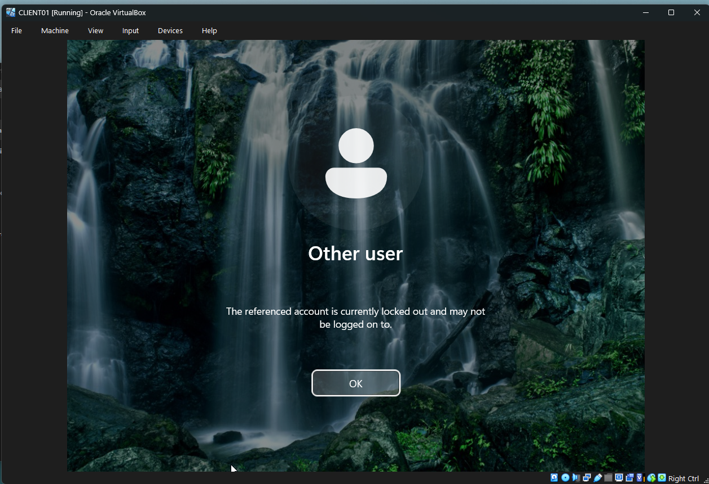

*Configured account lockout control successfully triggered after repeated failed authentication attempts.*

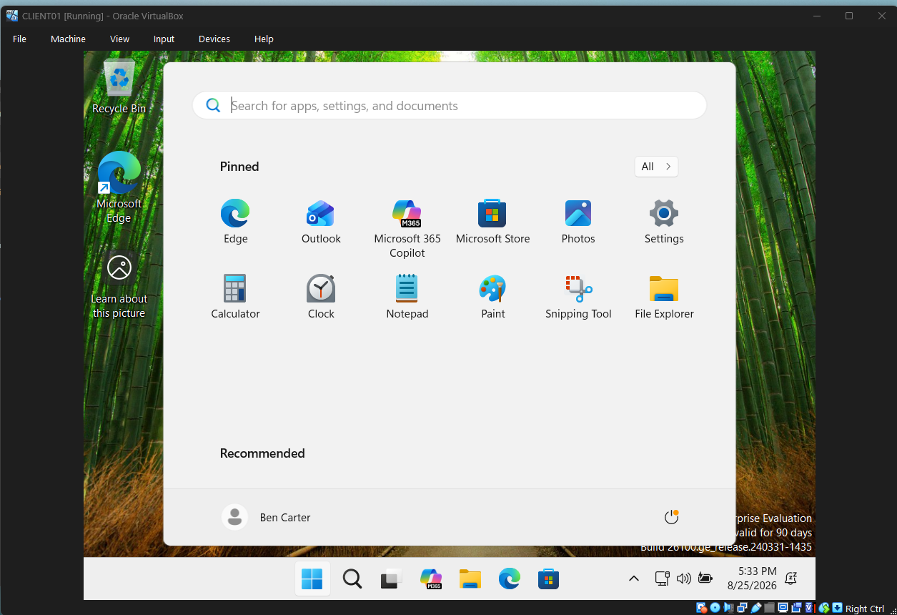

*Successful authentication restored after administrative account recovery.*

---

# PowerShell Administration and Automation

PowerShell was used throughout the project for administration, reporting, validation, and automation.

Initial Active Directory discovery commands included:

```powershell
Get-ADUser -Filter *
Get-ADGroup -Filter *
Get-ADComputer -Filter *
Get-ADOrganizationalUnit -Filter *
```

Four reusable administrative scripts were developed.

---

## Create-ADUsers.ps1

This script simulates an enterprise onboarding workflow where approved employee data is provided by HR and IT provisions the corresponding Active Directory accounts.

The script:

- prompts for the onboarding CSV filename
- validates that the file exists
- prompts securely for an initial password
- imports approved HR data
- checks for duplicate usernames
- validates manager identities
- creates Active Directory users
- assigns user attributes
- places accounts in department OUs
- assigns department security groups
- reports success or failure for each record

Example input workflow:

```text
HR onboarding ticket
        ↓
Approved onboarding CSV
        ↓
IT validates input
        ↓
PowerShell provisions Active Directory
        ↓
IT validates identity and access
```

Example input fields include:

```text
FirstName
LastName
Username
EmployeeID
Department
Title
Manager
StartDate
Location
OU
```

### Evidence

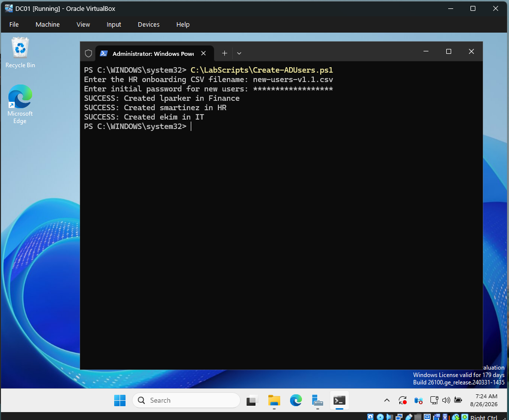

*CSV-driven PowerShell onboarding workflow successfully processing fictional employee records supplied through an HR-style intake file.*

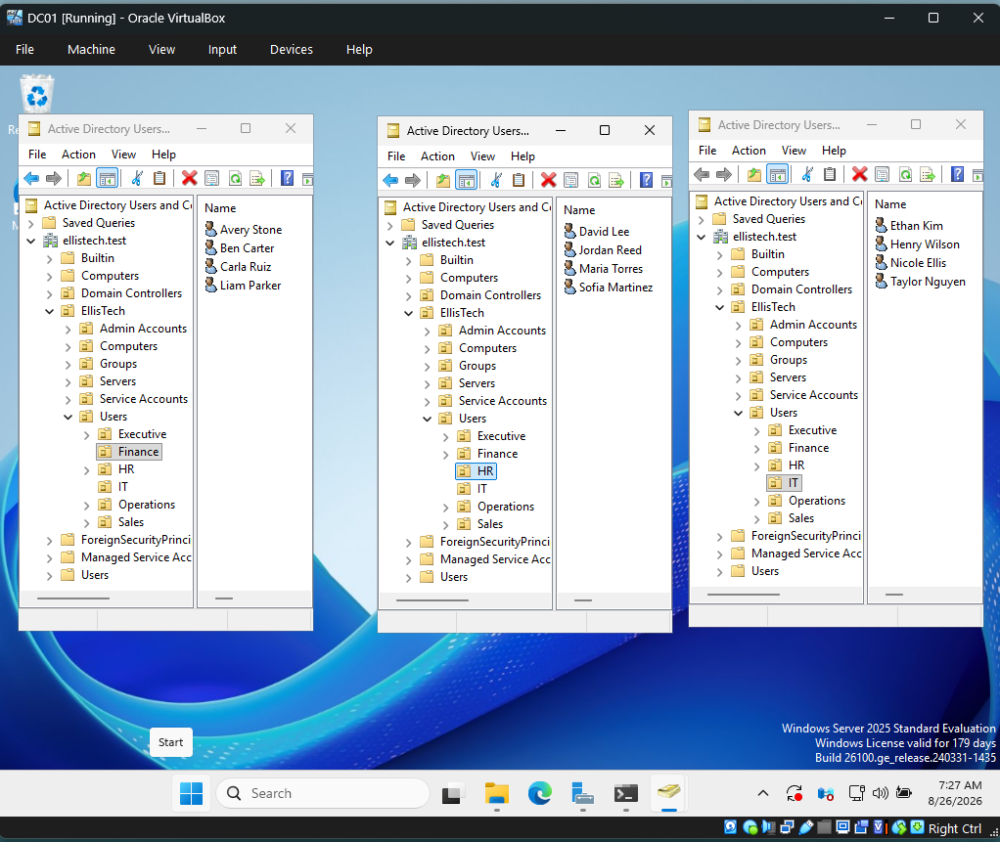

*Newly provisioned employee identities validated in Active Directory after automation completed.*

---

## Secure Credential Handling

AI assistance was used to accelerate script development.

Before executing generated code, the script was reviewed and a hardcoded password was identified.

That implementation was rejected and replaced with:

```powershell
Read-Host "Enter initial password for new users" -AsSecureString
```

This prevented credentials from being stored directly in the script.

This project treats AI-generated code as untrusted until it has been reviewed, understood, and validated.

Credentials are not intentionally hardcoded in repository scripts.

---

## AD-UserReport.ps1

Generates an Active Directory identity inventory report.

Example fields include:

```text
SamAccountName
DisplayName
EmployeeID
Department
Title
Enabled
DistinguishedName
```

Output is exported to CSV for administrative review.

---

## AD-ComputerInventory.ps1

Generates an inventory of domain computers.

Example fields include:

```text
Name
OperatingSystem
OperatingSystemVersion
Enabled
LastLogonDate
DistinguishedName
```

This provides a lightweight asset and directory inventory workflow.

---

## Disabled-Users-Report.ps1

Identifies disabled Active Directory accounts for identity hygiene and offboarding review.

Example fields include:

```text
SamAccountName
DisplayName
Department
Title
Enabled
LastLogonDate
DistinguishedName
```

This workflow supports periodic review of inactive or offboarded identities.

---

# Troubleshooting and Recovery

A major objective of this project was to demonstrate troubleshooting rather than only successful configuration.

Intentional and naturally occurring configuration issues were investigated, documented, corrected, and validated.

---

## Domain Controller DFSR Investigation

After Domain Controller promotion, `dcdiag` initially reported a DFS Replication event failure.

Instead of ignoring the result, the following areas were investigated:

```powershell
Get-Service DFSR
net share
repadmin /replsummary
repadmin /showrepl
Get-Service ADWS,DNS,DFSR,KDC,Netlogon
```

The investigation confirmed:

- DFSR was running
- SYSVOL was shared
- NETLOGON was shared
- core Domain Controller services were operational
- no replication partners existed because the environment contained one Domain Controller
- the reported DFSR events were historical post-promotion events rather than an ongoing failure

Event logs were reviewed to identify the original DFSR warnings and errors.

After the event window aged out and the server remained healthy, the final `dcdiag` completed without failed tests.

The full final diagnostic output is preserved in:

[`documentation/dcdiag-final.txt`](documentation/dcdiag-final.txt)

### Evidence

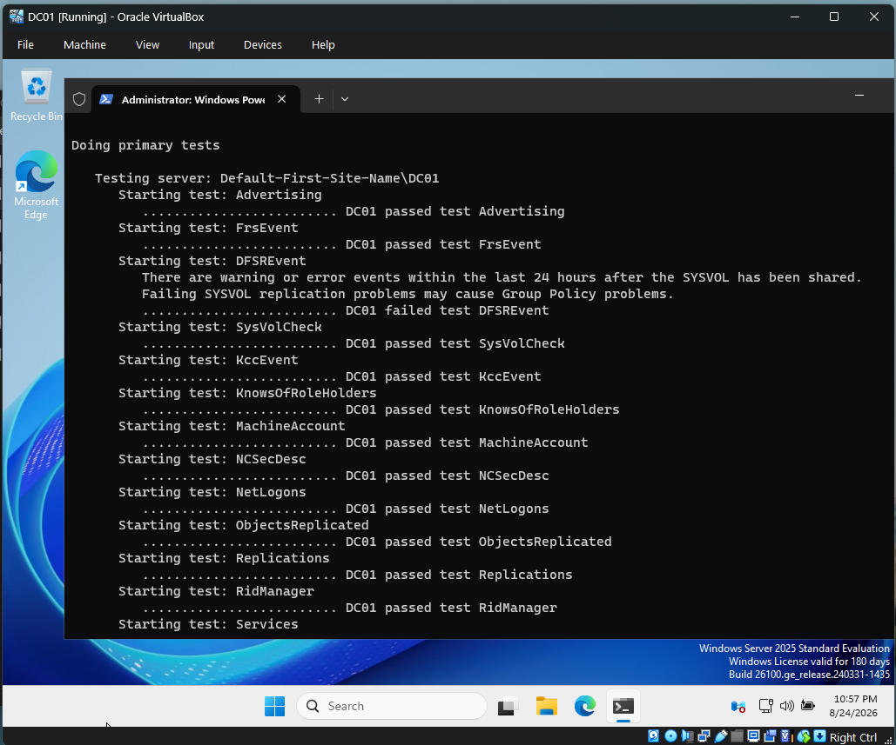

*Initial Domain Controller health validation identified a DFS Replication-related failure.*

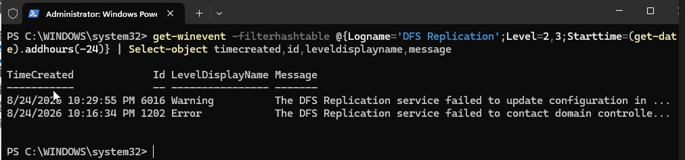

*DFSR Event Log investigation used to distinguish historical promotion events from an active service failure.*

---

## Group Policy Precedence Troubleshooting

During account lockout testing, the configured lockout threshold was not taking effect.

Validation with:

```powershell
net accounts /domain
```

showed:

```text
Lockout threshold: Never
```

even though the custom policy specified five failed attempts.

Investigation showed that Group Policy link order affected the effective policy.

The link order was corrected so the intended password/account policy had higher precedence.

After:

```powershell
gpupdate /force
```

the effective policy showed the correct lockout threshold and the lockout test succeeded.

This demonstrated the difference between configured settings and effective policy.

### Evidence

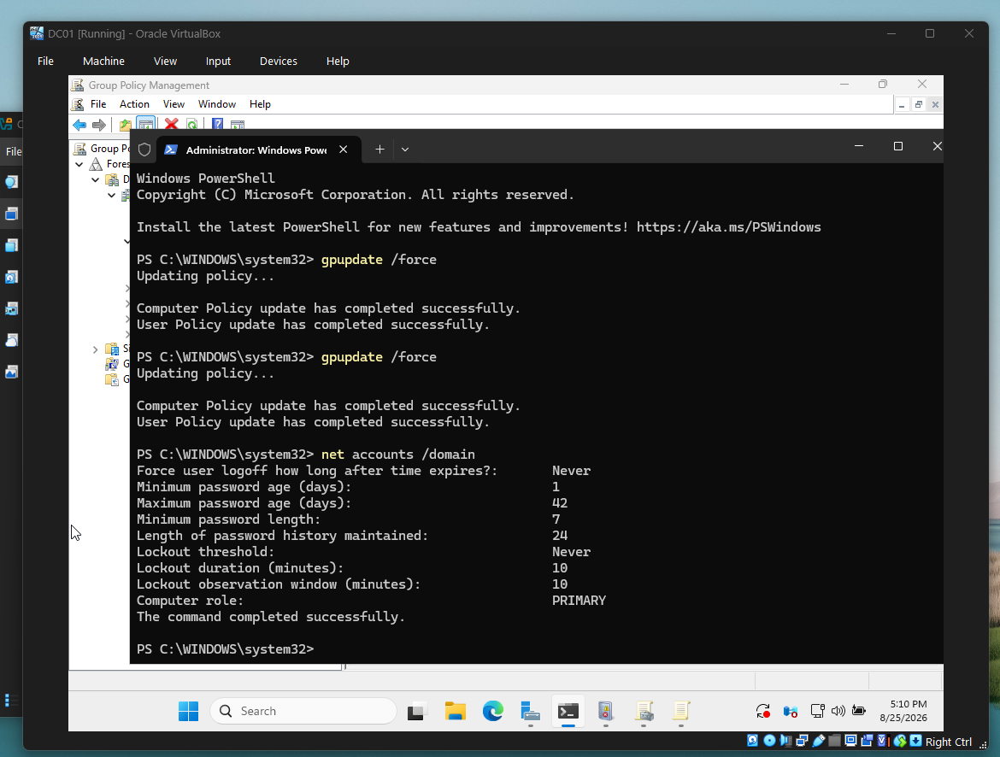

*Troubleshooting revealed that the configured account lockout policy was not the effective domain setting.*

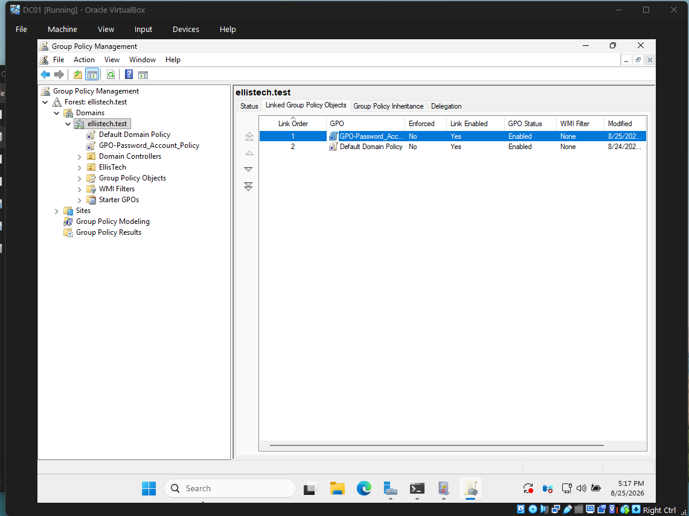

*Group Policy precedence corrected so the intended password and lockout policy became effective.*

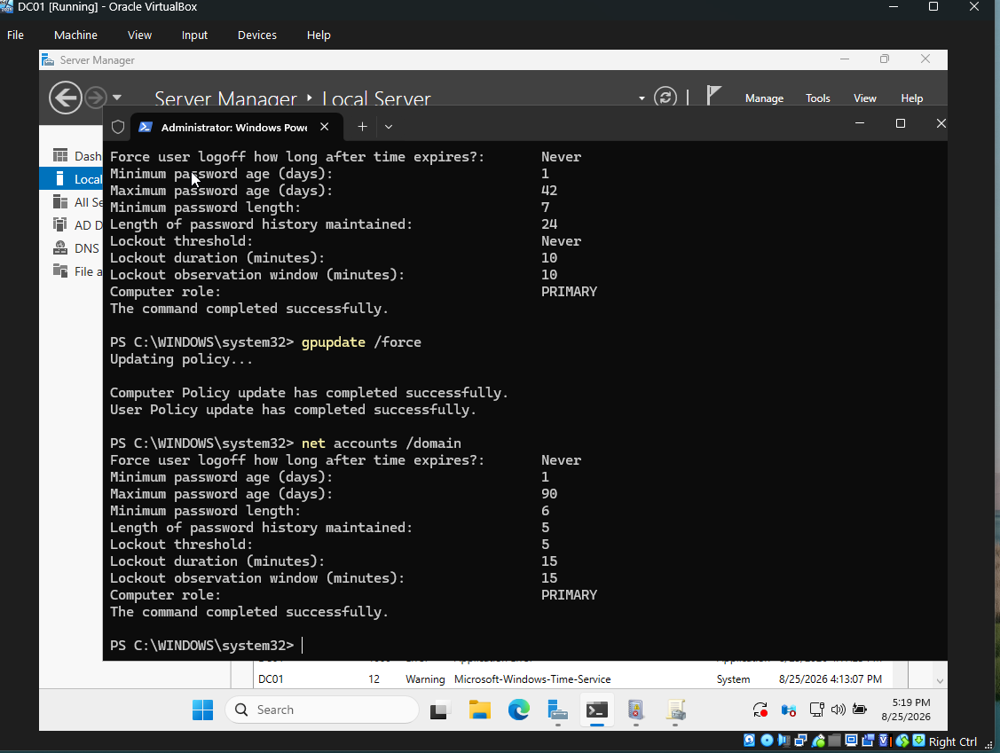

*Effective account lockout policy validated after correcting Group Policy precedence.*

---

## DNS Failure and Recovery

CLIENT01 was intentionally configured with an incorrect DNS server:

```text
8.8.8.8
```

Domain name resolution failed.

Troubleshooting included:

```powershell
Get-DnsClientServerAddress
ipconfig /all
nslookup dc01.ellistech.test
```

The client DNS configuration was restored using:

```powershell
Set-DnsClientServerAddress -InterfaceAlias "Ethernet" -ServerAddresses 10.10.10.10
ipconfig /flushdns
```

DNS resolution was then successfully restored.

### Evidence

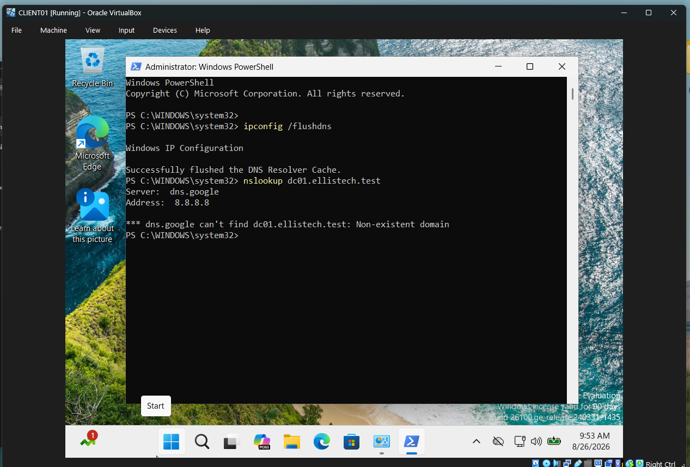

*CLIENT01 intentionally configured with an incorrect DNS resolver to reproduce domain-resolution failure.*

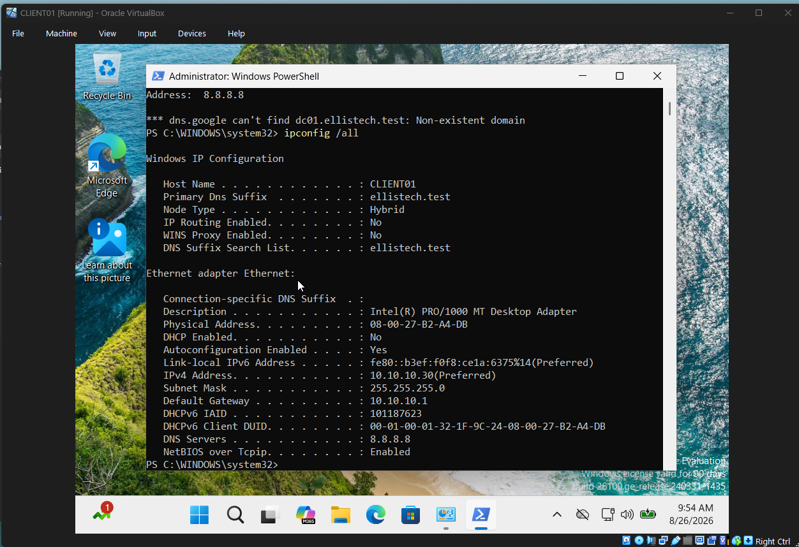

*DNS configuration and failed name resolution used to identify the root cause.*

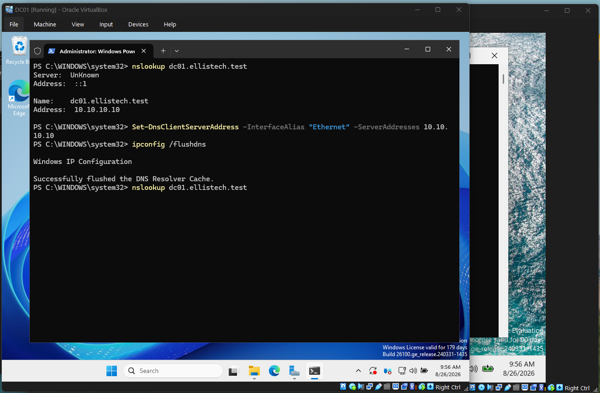

*CLIENT01 restored to the internal DNS server at `10.10.10.10`, successfully restoring domain resolution.*

---

## NTFS Permission Failure and Recovery

Finance access was intentionally broken by removing:

```text
GG_Finance_RW
```

from the Finance folder permissions.

A Finance user then received:

```text
Access Denied
```

when accessing:

```text
\\SRV01\Finance
```

The missing group permission was identified and restored.

Access was retested successfully.

### Evidence

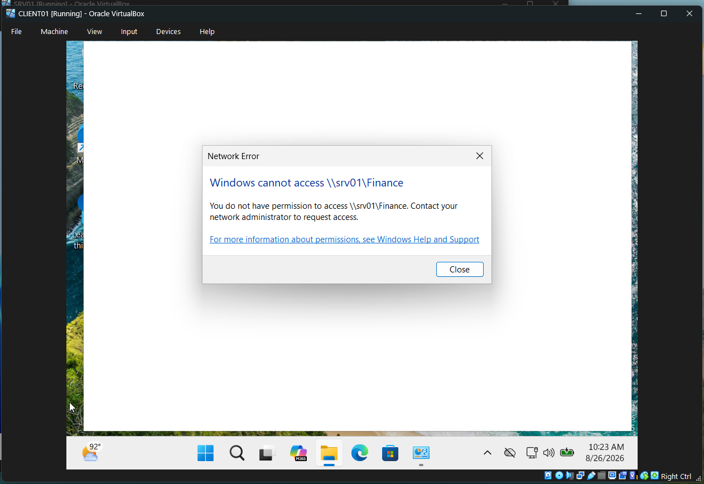

*Finance user receives Access Denied after the required NTFS security group permission is intentionally removed.*

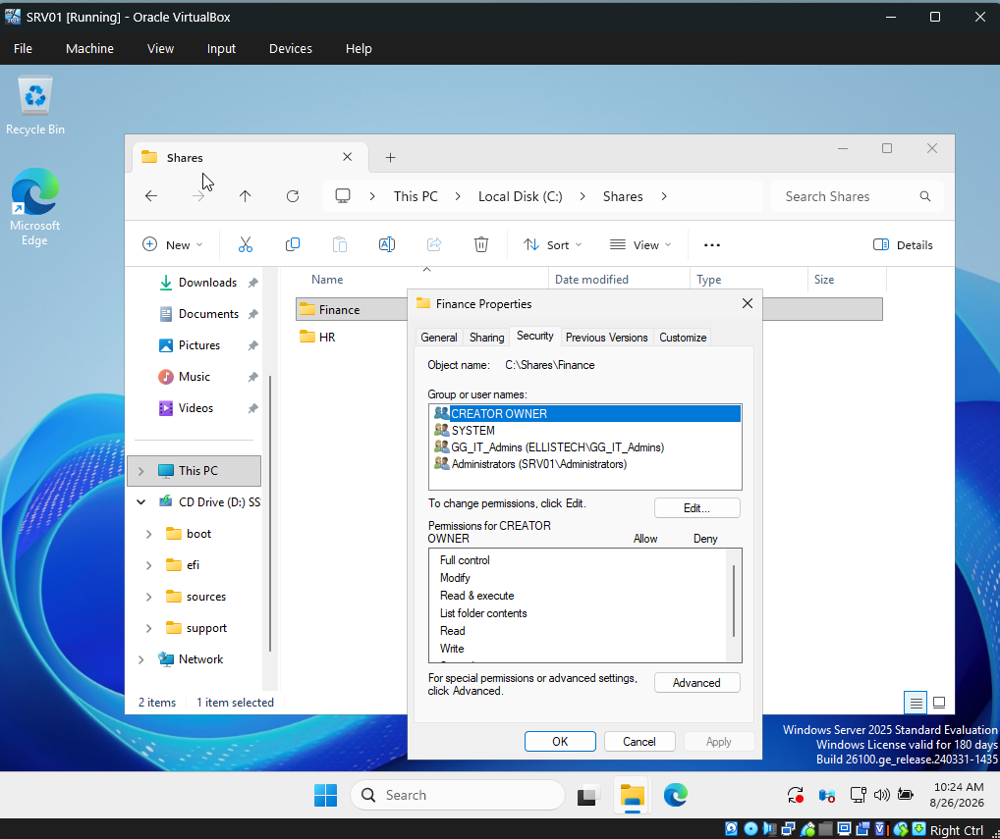

*Permission review identifies the missing Finance access group.*


*Finance access successfully restored after correcting NTFS permissions.*

---

## Group Policy Failure and Recovery

The login banner GPO was intentionally unlinked from the workstation OU.

After:

```powershell
gpupdate /force
gpresult /scope computer /r
```

the policy was confirmed missing from the effective workstation policy set.

The GPO was relinked and Group Policy refreshed.

The policy reappeared in the applied policy results and the login banner was restored.

### Evidence

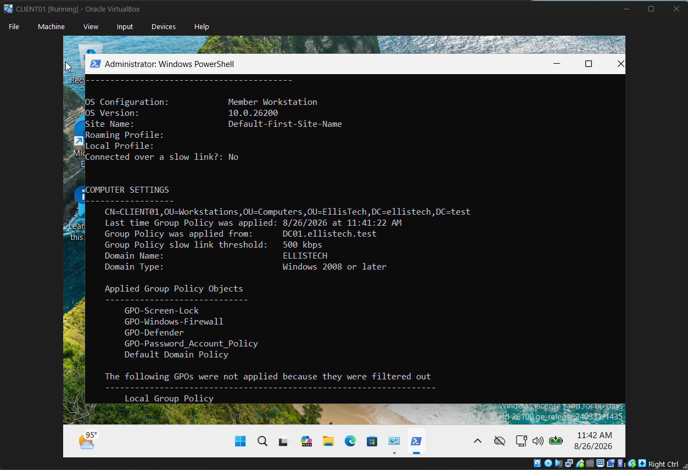

*Effective policy validation showing the login banner GPO missing after intentional unlinking.*

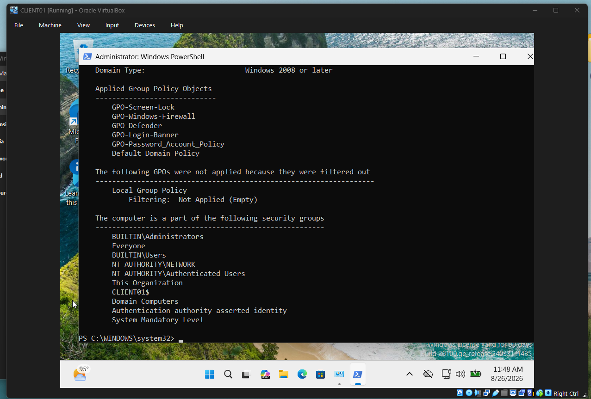

*Login banner policy restored after correcting the GPO link.*

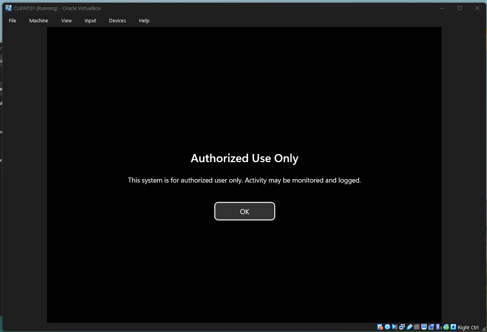

*Interactive sign-in confirms successful restoration of the authorized-use login banner.*

---

# Final Validation

Before publication, the infrastructure underwent a final validation sweep.

| Area | Validation Method | Result |
|---|---|---|
| Domain Controller | `dcdiag` | PASS |
| DNS | `nslookup`, `ipconfig /all` | PASS |
| Domain Authentication | `whoami`, `hostname` | PASS |
| Group Policy | `gpresult /scope computer /r` | PASS |
| Windows Firewall | `Get-NetFirewallProfile` | PASS |
| Microsoft Defender | `Get-MpComputerStatus` | PASS |
| Least Privilege | `net localgroup administrators` | PASS |
| File Permissions | NTFS and share review | PASS |
| AD Automation | PowerShell execution | PASS |
| HR Onboarding Workflow | CSV → PowerShell → AD validation | PASS |
| DNS Recovery | Failure → diagnosis → restoration | PASS |
| NTFS Recovery | Failure → diagnosis → restoration | PASS |
| GPO Recovery | Failure → diagnosis → restoration | PASS |
| Account Recovery | Lockout → administrative recovery | PASS |

The complete Domain Controller diagnostic output is available at:

[`documentation/dcdiag-final.txt`](documentation/dcdiag-final.txt)

### Final Health Evidence

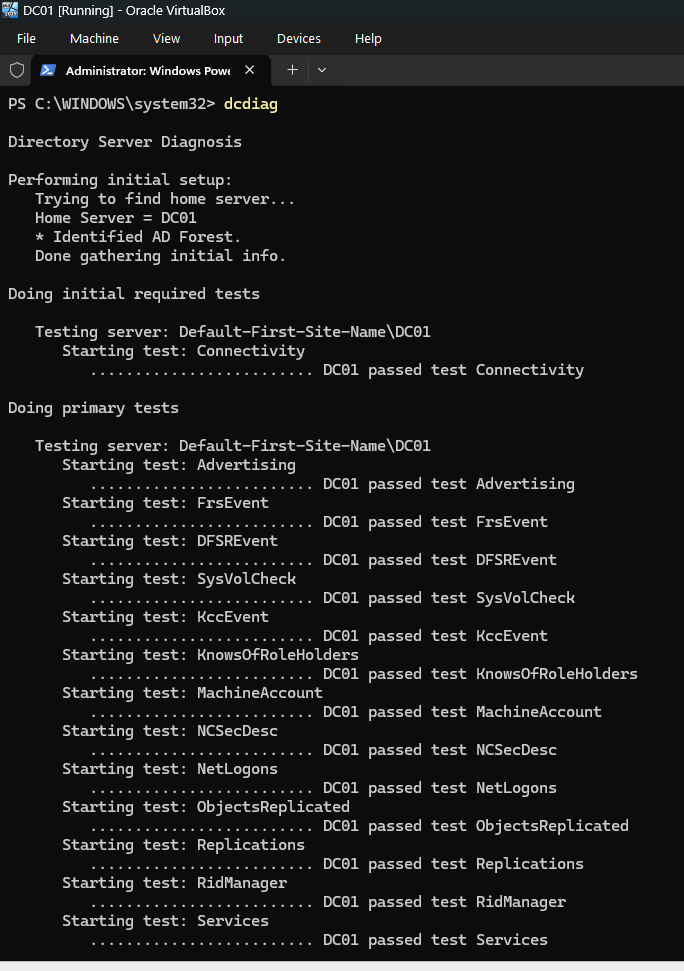

*Final Domain Controller health validation after completing configuration and troubleshooting activities.*

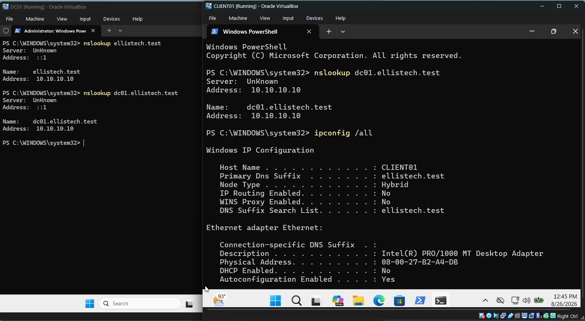

*Final confirmation that CLIENT01 is using the internal Domain Controller for DNS and resolving the EllisTech domain correctly.*

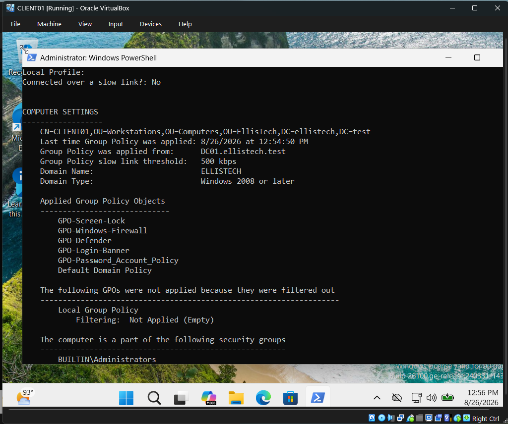

*Final effective Group Policy validation on CLIENT01.*

### Validation Summary

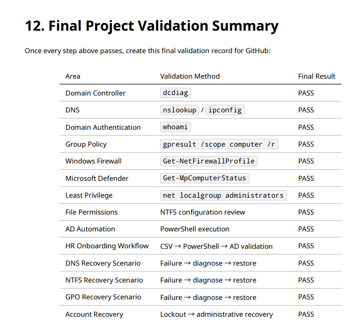

*Final project validation summary documenting successful health, identity, policy, security, automation, and recovery checks.*

---

# Key Challenges and Lessons Learned

## Distinguishing Historical Events from Active Failures

The DFSR investigation reinforced that a warning or failed health check should not automatically be treated as proof of an active outage.

Current service state, shares, event history, replication status, and later validation were used together to determine whether the issue remained active.

---

## Understanding Effective Group Policy

The account lockout issue demonstrated that configuring a setting inside a GPO does not guarantee that it becomes the effective domain policy.

Link location, inheritance, scope, and precedence must also be evaluated.

---

## Permission Inheritance

The file server configuration demonstrated how inherited NTFS permissions can unintentionally create broader access than intended.

Disabling inheritance and converting inherited permissions into explicit permissions allowed the access model to be hardened without removing required system access.

---

## Treating AI-Generated Code as Untrusted

AI-assisted scripting accelerated development, but generated code was reviewed before execution.

A hardcoded credential pattern was identified and replaced with secure runtime input.

The lesson was not simply how to generate PowerShell, but how to review automation before trusting it.

---

# Skills Demonstrated

This project demonstrates hands-on experience with:

- Windows Server administration
- Active Directory Domain Services
- DNS administration
- organizational unit design
- user lifecycle administration
- security group administration
- privileged account separation
- domain joins
- Group Policy
- password and lockout policy
- endpoint firewall configuration
- Microsoft Defender
- Windows security auditing
- Event Viewer investigation
- NTFS permissions
- SMB shares
- role-based access control
- PowerShell
- CSV-driven automation
- identity reporting
- asset inventory reporting
- onboarding workflows
- troubleshooting
- root-cause analysis
- recovery validation
- technical documentation
- Git and GitHub

---

# Production Improvements

This project intentionally uses a compact lab architecture.

A production implementation would require additional controls and redundancy.

Potential improvements include:

- deploy at least two Domain Controllers
- provide redundant DNS
- implement tested Active Directory backup and recovery procedures
- deploy Microsoft security baselines
- implement Windows LAPS
- strengthen privileged access management
- centralize security logs into a SIEM
- deploy enterprise endpoint management
- implement formal patch management
- integrate vulnerability management
- create a reverse DNS lookup zone and PTR records
- evaluate DNSSEC based on organizational requirements
- integrate Microsoft Entra ID for hybrid identity
- implement automated joiner/mover/leaver workflows
- integrate an HRIS or ticketing platform with identity automation
- add monitoring and alerting for infrastructure health

The single-Domain-Controller architecture used here is appropriate for a lab but would not be recommended for production.

---

# Repository Structure

```text
Windows_infrastructure_administration/
├── README.md
├── .gitignore
├── diagrams/
│   ├── lab-architecture.md
│   └── lab-architecture.png
├── screenshots/
│   ├── 01-virtual-network.png
│   ├── ...
│   ├── 81-dns-failure-client-misconfiguration.png
│   ├── 82-dns-failure-diagnosis.png
│   ├── 83-dns-resolution-restored.png
│   ├── ...
│   ├── 99-final-file-permission-validation.png
│   └── Validation_Summary.png
├── scripts/
│   ├── Create-ADUsers.ps1
│   ├── AD-UserReport.ps1
│   ├── AD-ComputerInventory.ps1
│   └── Disabled-Users-Report.ps1
├── sample-data/
└── documentation/
    └── dcdiag-final.txt
```

---

# Evidence Library

The README presents selected evidence to keep the case study readable.

The complete project contains **101 sequential screenshots** documenting the environment from initial VirtualBox network configuration through final infrastructure validation.

Browse the complete evidence library:

### [View all 101 project evidence items →](screenshots/)

The sequence documents the project lifecycle chronologically:

```text
Architecture
    ↓
Server Deployment
    ↓
Active Directory & DNS
    ↓
OU / Identity Design
    ↓
Member Server
    ↓
File Services
    ↓
Domain Workstation
    ↓
Group Policy
    ↓
Security Hardening
    ↓
PowerShell Automation
    ↓
Troubleshooting
    ↓
Recovery
    ↓
Final Validation
```

---

# Project Outcome

The completed environment demonstrates the full lifecycle of administering a small Windows infrastructure environment:

```text
Design
  ↓
Deploy
  ↓
Configure
  ↓
Secure
  ↓
Automate
  ↓
Troubleshoot
  ↓
Recover
  ↓
Validate
  ↓
Document
```

The final environment successfully passed Domain Controller health, DNS, authentication, Group Policy, endpoint security, access control, automation, and recovery validation.

The purpose of this project is not to represent a production-ready enterprise architecture, but to demonstrate practical Windows infrastructure administration skills and the ability to design, operate, troubleshoot, secure, automate, validate, and document a Windows domain environment.